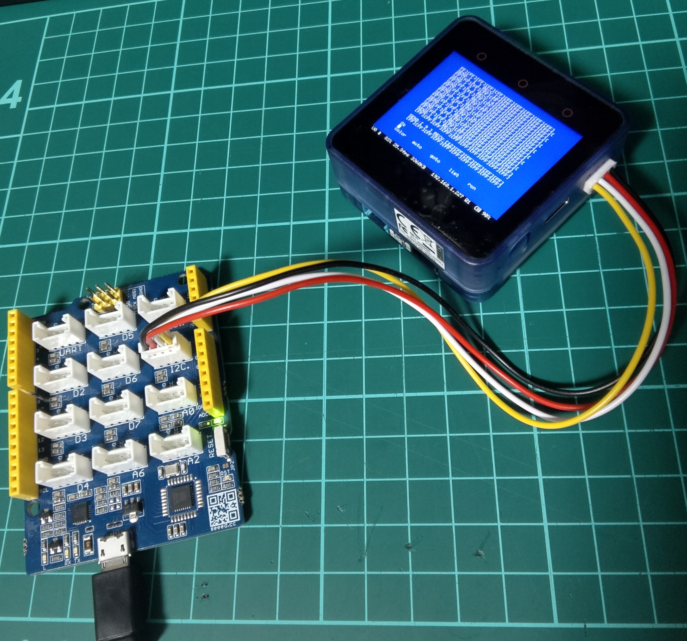
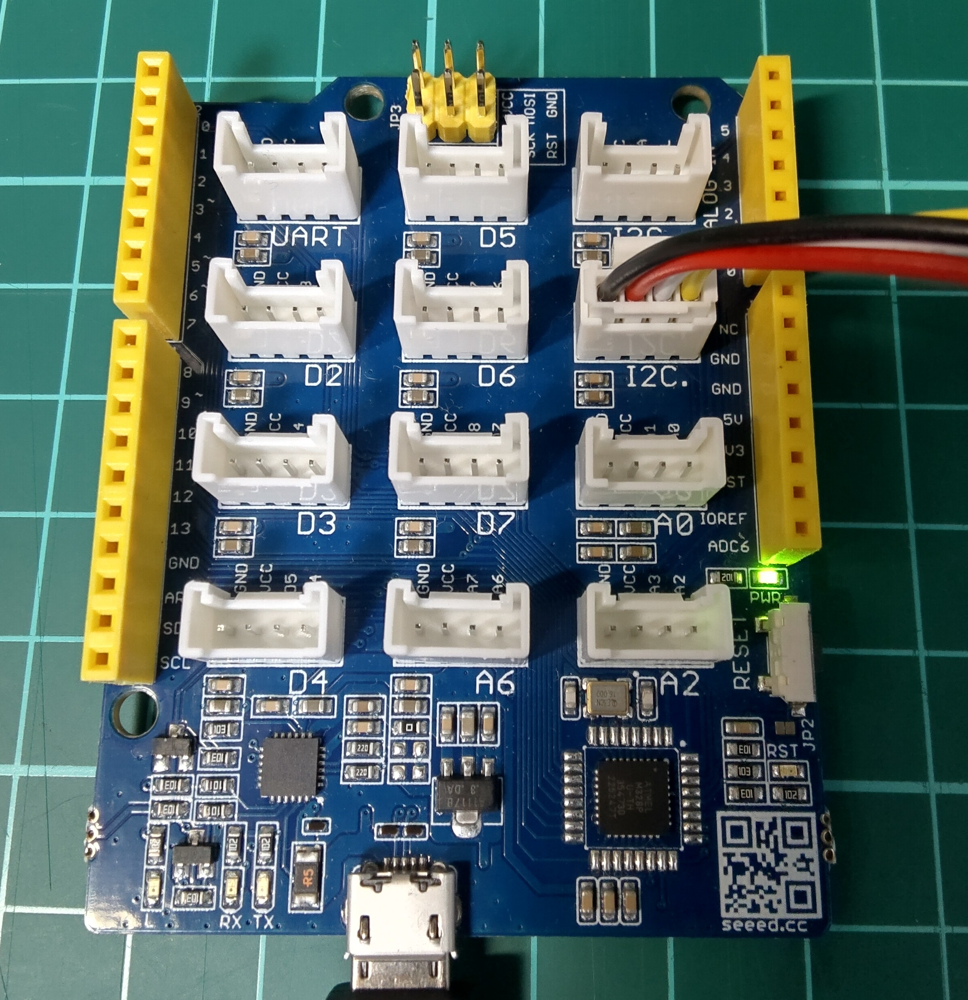

# I2C sample<!-- omit in toc -->

- [能書き](#能書き)
- [スレーブ側(Arduino)の動作(I2C\_slave.ino)](#スレーブ側arduinoの動作i2c_slaveino)
- [マスター側(MSX0)の動作(I2C\_test.bas)](#マスター側msx0の動作i2c_testbas)
- [MSX0とArduinoの接続](#msx0とarduinoの接続)
- [留意点](#留意点)
- [おことわり](#おことわり)

## 能書き




MSX0といえばIoT BASIC（IoT関連機能の拡張命令を追加した拡張BASIC）ということで、IoTっぽいことをやってみようと思ったのですが、温湿度センサーとか持っていないので、まずは疎通確認的なのできないかなあということで。

I2C通信については、添付のディスクイメージ（SAMPLE.DSKファイル）にI2C.BASというサンプルコードが入っているので、それをベースにサンプルコードよりもより単純な通信を試してみました。

通信というからには通信相手も必要です。

I2Cはマスター・スレーブでの主従関係を持つ通信になるのですが、MSX0側をマスターとみなすと考えますと、スレーブになる通信相手が必要です。

こういう時は、何と言ってもお手軽さが群を抜いているのがArduinoですね。

文献がネットにたくさんあるので、すぐにサンプルを持ってきて試すことができます。

マスター（MSX0）側からスレーブ（Arduino）側へ数値を送り、その値に１を加算したものを受け取るサンプルプログラムです。

## スレーブ側(Arduino)の動作(I2C_slave.ino)

I2Cマスターからのデータを受信すると、その数値に１を加算した値をマスターに返すように動作します。

ソース中で

```C++
Wire.begin(8);
```

で指定している引数(8)は、スレーブのデバイスIDの指定です。ちなみにスレーブのデバイスIDは何でも良いわけではなく、予約されている番号などもあるので、注意が必要です。

また、

```C++
Wire.onReceive(リスナー関数名);
```

で指定しているリスナー関数`dataReceive` はI2Cマスターからのデータ送信があると実行されます。MSX0では、`_IOTPUT()`命令を実行するとマスターからのデータ送信になるため、その際にこのリスナー関数が実行されます。

リスナー関数には引数としてint型の`number`があり、ここにマスターから送信されるデータのバイト数が渡されます。なので、本来は関数内の

```C++
Wire.read()
```

は`number`の数だけ繰り返し受け取る必要があるのですが、今回は１バイト送信決め打ちで処理しているので引数`number`は無視しています。

次に、スレーブ側からマスター側へのデータの返信ですが、I2Cではスレーブ側から何の前触れもなく値を送り付けるということはないらしく（あったとしてもマスター側で受け取れない？）、あくまでマスター側からリクエストされたら値を送り返す、という仕組みになっているようです。

スレーブ側(Arduino)では、

```C++
Wire.onRequest(リスナー関数名);
```

という関数で、マスター側から値を送るようリクエストを受けたときに実行したい関数を設定できます。MSX0では、`_IOTGET()`命令を使うとマスターからスレーブにリクエストを出すことに相当します。

リスナー関数内では、直前にマスターから受け取った値に1を加算した値を

```C++
Wire.write(receiveValue+1);
```

で送信しています。

スレーブ(Arduino)側のコードについては、ネットを調べるといろいろとサンプルコードが出てきますが、中の人は、こちらの記事を参考に作ってみました。というか、お手本ほとんどそのままです。ありがとうございます。

**Arduino初心者編：I2C通信によるArduino間のデータ送受信 | STEMSHIP**
[https://stemship.com/arduino-beginner-i2c/](https://stemship.com/arduino-beginner-i2c/)

## マスター側(MSX0)の動作(I2C_test.bas)

MSX0側では、IoT BASICでI2C通信を実行できます。

このプログラムは、MSX0に添付されているサンプルプログラムとして添付されていたI2C.BASをベースに、処理を単純化したものです。

このプログラムでは、0から9までの数値をI2Cスレーブに送り、その応答を受け取るように処理しています。

行1020の

```BASIC
_IOTFIND("device/i2c_a",C)
```

で、I2Cスレーブデバイスの個数が変数Cに格納されて返されます。

マニュアルでは「対象のノードが持つアイテムの個数を取得します」とあるので、I2Cの場合はスレーブの数と思われます。

引数に指定している`"device/i2c_a"`は、デバイスのノードパスで、アクセスしたいデバイスに応じて変化します。

ちなみに、`"i2c_a"`と「a」がついているのは、MSX0(M5Stack Core2)のPORT Aを示しているものと思われます。

ここでCに0が入った場合は、スレーブデバイスが繋がっていないか、スレーブデバイスを認識できていない（動いていない）ので、その旨のメッセージを行1200以降で表示し終了します。

行1050を実行するのは、I2Cスレーブが存在することが確認できた場合なので、今度はデバイスIDを含めて取得するために、

```BASIC
_IOTFIND("device/i2c_a",A$(0),C)
```

のように配列変数を指定すると、アイテム名（I2Cの場合はスレーブのデバイスID）が配列としてA$に格納されます。変数Cにはおそらく先ほどと同じくスレーブデバイスの数が返されると思われます。

これを調べて、期待されるデバイスID（ここでは、スレーブのデバイスIDである"08"のこと）に等しいものが配列A$に含まれていれば、次の処理に進みます。

※ 返されるアイテム名はゼロサプレスされていないので、比較照合の際は注意が必要

正直、I2Cハブなどを使っていなくて、１つのスレーブしか繋いでいなければ、１個めのIDをそのまま無条件に採用しても良いと思われますが、間違って違うデバイスを繋いだときのことを考慮するとチェックするに越したことはないのでしょう。

デバイスIDが確定したら、ノードパスにデバイスIDを追加します。

行1310の

```BASIC
N$="device/i2c_a/"+A$(I)
```

の箇所です。

MSX0でマスターからスレーブに送信したい情報がある場合は、行2050のように

```BASIC
_IOTPUT(ノードパス,送信したい値)
```

と指定します。

8bitの情報を送りたい場合は、`CHR$(送りたい値)`のように文字列として指定します。複数バイト一挙に送りたい場合は、`CHR$(nn)`を連結して複数文字の文字列にして送信します。

`_IOTPUT()`で文字列データを送る場合、MSX BASICの文字列変数の最大長(256文字=256バイト)までは送信可能と思われますが、スレーブ側が何バイトまで受信できるかはスレーブデバイスの実装に依存します。Arduino UNOの場合、I2Cの受信バッファは32バイトなので、それ以上の長さのデータを一度に送ることは出来ません。

スレーブデバイスからの応答を受け取りたい場合は、行2070のように

```BASIC
_IOTGET(ノードパス,受信内容を格納する変数)
```

と指定します。

`_IOTGET()`で得られる値（文字列）は、16バイト固定で、必ず第2引数の変数には16文字分の文字列が入ってきます。

このプログラムでは返信は１バイトに決め打ちしているため、返信内容から`ASC(S$)`として１バイト分のデータだけを取り出しています。MSX BASICの`ASC()`関数は文字列の先頭１文字目のアスキーコードを返す仕様なので、上記のコードではあたかもスレーブから１バイトだけ受け取っているように見えていますが、実際には後ろの15文字は捨てていることになります。

(2024.4.9追記) I2C_TEST.BASを更新して、`_IOTGET()`で得られた16バイトの内容を16進数で表示するようにしたので、上記の挙動は最新のソースでは変更されています。


## MSX0とArduinoの接続

MSX0はPORT AにGroveコネクタなどを繋ぎます。

Arduino側はI2C通信用に専用のピン(SDA,SCL)が用意されています。Arduino Mini Proなどのようにそれらのピンが省略されている場合でも、A4ピンがSDA、A5ピンがSCKになっていますので、そちらに繋げばOKです。

| ピン | Arduino | MSX0 |
| ---- | ----| ---- |
|SDA| SDA/A4 | PORT Aの左から２番目のピン|
|SCL| SCK/A5 | PORT Aの一番左のピン|
|GND| GNDのどれか | PORT Aの一番右のピン|

※PORT Aの5V(右から２番目のピン)は今回使わない(MSX0からスレーブデバイスに電源供給しない)ので接続しなくてOKです。

MSX0標準のGrove Beginner Kit for MSX0に付属のSeeeduino Lotus(Arduino UNO互換機)を使う場合は、"I2C."と書かれたGroveコネクタにつなぐだけでOKです。また、電源がMSX0側から共有されるので、Seeeduino Lotusにプログラムを転送したあとは、USBケーブルを外しても動作します。



## 留意点

Arduino側スレーブデバイスの準備に関して、ひとつ気になるポイントとして、中の人が良く使っているArduino Unoは通常5V駆動ですが、M5Stack（のマイコンであるESP32）は3.3V駆動のようで、電圧レベルの異なる機器をそんなにひょいひょい繋いじゃっていいの？という問題があるようです。

この件について考察されている下記の記事を読む限り、繋いだ途端に破損・・・ということはないようですが（中の人も最初はArduino Unoで繋いで動かしましたが無事でした）、なんとなく心配は心配なので、可能であれば3.3V駆動のArduinoに繋ぐのが無難なのかもしれません。

**M5StackのI2C信号の電圧｜くりばた**
[https://note.com/kuribata/n/n0c46035cc5e0](https://note.com/kuribata/n/n0c46035cc5e0)

I2Cの仕様上は、電圧の異なる複数のデバイスを接続することは想定されているようなのですが、電気的にどう解決するかはおそらくデバイスの実装依存なのではないかと思います。

## おことわり

上記件に関して、なにぶんにも、中の人は電子工作、電子回路については完全な素人なのでたいしてよくわかっていないことのほうが多いです。

記事の内容をお試しになる場合は、自己責任でお願いいたします。この記事にある通りのことを試してお手持ちの機器を破損しても中の人は一切の責任を負いません。

Arduinoは互換機含め様々入手経路があり、価格も安価なものがたくさんありますが、MSX0については、2023年10月時点で破損すると、基本的には一般販売開始を待たなければいけなくなります。

このことに同意できない方は記事の内容を試されないようにお願いいたします。

以上
