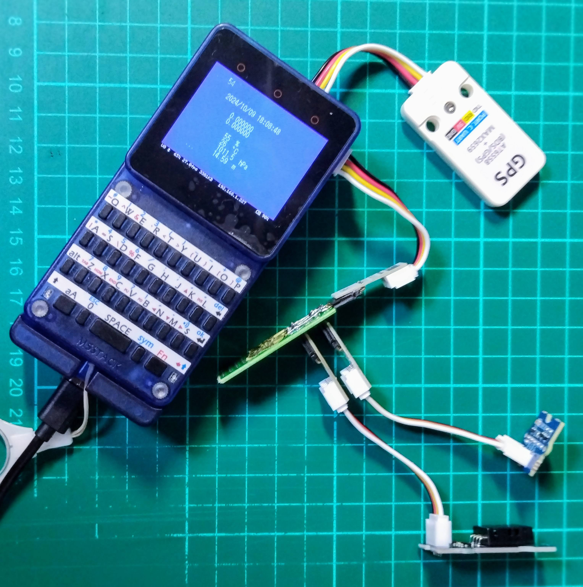
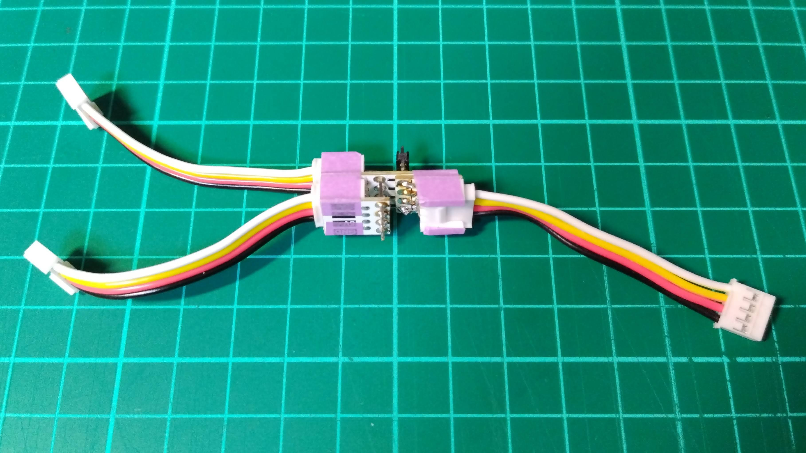
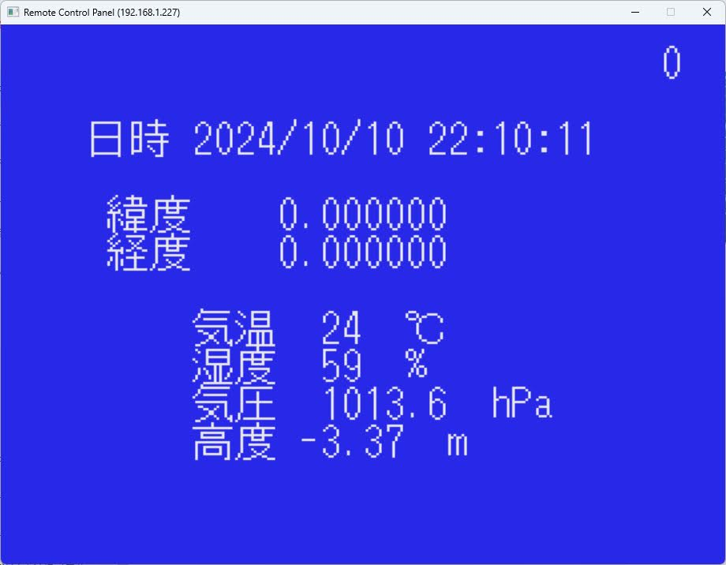

# MSX0で位置情報/温度/湿度/気圧/高度を記録していくBASICプログラム <!-- omit in toc -->

## 能書き

MSX IoT BASICのUART通信、I2C通信機能を利用して、GPS/温湿度センサー/気圧センサーから得た値をCSV形式でファイルに記録していくBASICプログラムです。

プログラムのファイル名(LTHPA.bas)は、Location(位置情報)/Temperature(温度)/Humidity(湿度)/Pressure(気圧)/Altitude(高度)の略称です。なんのひねりもなくてすいません。

センサーデバイスは以下のものを使っています。

- GPSデバイス
  - M5Stack用GPSユニット U032
- 温湿度センサー
  - Grove Temperature & Humiditiy Sensor(DHT11)
    - MSX0センサーキット(Grove Beginner Kit for Arduino)に含まれているセンサーです。
- 気圧センサー
  - Grove Air Pressure Sensor(BMP280)
    - MSX0センサーキット(Grove Beginner Kit for Arduino)に含まれているセンサーです。

I2Cデバイスを２つ使うため、I2Cハブが必要になります。ハブと言っても、複数のGroveコネクタの同じ端子をすべて直結させればよいようなので、中の人は手持ちのパーツを使って自作しました。

測定結果の記録は、`GPS_LOG.TXT`というファイルに60秒に１回のペースで行われていきます。
それ以外に、任意のキーを入力すると即時記録を行うことができます。

## 実行時の画面

実行時の画面は以下のとおりです。

## 出力結果ファイルの内容

`GPS_LOG.TXT`の内容は以下のようなものです。

| DateTime           | NS | Lat     | EW | Lng       | Humidity | Temperature | Pressure | Altitude |
|--------------------|----|---------|----|-----------|----------|-------------|----------|----------|
| 2024/10/10 14:18   | N  | 35.68106| E  | 139.767307| 60       | 24.01       | 1009.6   | 31.14    |
| 2024/10/10 14:19   | N  | 35.68106| E  | 139.767307| 61       | 23.95       | 1010     | 27.6     |
| 2024/10/10 14:20   | N  | 35.68106| E  | 139.767307| 59       | 23.75       | 1010.1   | 27.07    |
| 2024/10/10 14:21   | N  | 35.68106| E  | 139.767307| 60       | 23.61       | 1010.5   | 23.01    |
| 2024/10/10 14:22   | N  | 35.68106| E  | 139.767307| 60       | 23.4        | 1011     | 18.78    |
| 2024/10/10 14:23   | N  | 35.68106| E  | 139.767307| 60       | 23.38       | 1011     | 18.95    |
| 2024/10/10 14:24   | N  | 35.68106| E  | 139.767307| 59       | 23.39       | 1011.1   | 18.35    |
| 2024/10/10 14:25   | N  | 35.68106| E  | 139.767307| 64       | 23.53       | 1011     | 18.62    |
| 2024/10/10 14:26   | N  | 35.68106| E  | 139.767307| 62       | 23          | 1011.1   | 18.39    |
| 2024/10/10 14:27   | N  | 35.68106| E  | 139.767307| 63       | 24.19       | 1011.1   | 18.49    |
| 2024/10/10 14:28   | N  | 35.68106| E  | 139.767307| 58       | 24.33       | 1011     | 18.84    |
| 2024/10/10 14:29   | N  | 35.68106| E  | 139.767307| 59       | 24.46       | 1011     | 18.77    |
| 2024/10/10 14:30   | N  | 35.68106| E  | 139.767307| 60       | 24.65       | 1011     | 18.95    |
| 2024/10/10 14:31   | N  | 35.68106| E  | 139.767307| 60       | 24.86       | 1011     | 18.62    |
| 2024/10/10 14:32   | N  | 35.68106| E  | 139.767307| 60       | 25.15       | 1011.1   | 18.55    |
| 2024/10/10 14:33   | N  | 35.68106| E  | 139.767307| 57       | 25.27       | 1011     | 18.73    |
| 2024/10/10 14:34   | N  | 35.68106| E  | 139.767307| 55       | 24          | 1011     | 18.62    |
| 2024/10/10 14:35   | N  | 35.68106| E  | 139.767307| 56       | 24          | 1011.2   | 17.21    |
| 2024/10/10 14:36   | N  | 35.68106| E  | 139.767307| 57       | 23          | 1011.2   | 17.53    |
| 2024/10/10 14:37   | N  | 35.68106| E  | 139.767307| 57       | 23.77       | 1011.2   | 17.43    |
| 2024/10/10 14:38   | N  | 35.68106| E  | 139.767307| 54       | 23.35       | 1011.1   | 17.92    |
| 2024/10/10 14:39   | N  | 35.68106| E  | 139.767307| 52       | 22.87       | 1011.1   | 17.89    |
| 2024/10/10 14:40   | N  | 35.68106| E  | 139.767307| 53       | 22.79       | 1011.2   | 17.46    |
| 2024/10/10 14:41   | N  | 35.68106| E  | 139.767307| 58       | 22.98       | 1011.2   | 17.04    |
| 2024/10/10 14:42   | N  | 35.68106| E  | 139.767307| 60       | 23.31       | 1011.1   | 18.09    |
| 2024/10/10 14:43   | N  | 35.68106| E  | 139.767307| 62       | 23.5        | 1011.2   | 17.5     |
| 2024/10/10 14:43   | N  | 35.68106| E  | 139.767307| 62       | 23.5        | 1011.2   | 17.5     |
| 2024/10/10 14:43   | N  | 35.68106| E  | 139.767307| 62       | 23.5        | 1011.2   | 17.5     |

## プログラムの構造

おおよそのプログラムの構成は以下のとおりです。

| 行番号  | 内容                                                     |
| ------- | -------------------------------------------------------- |
| 1000〜  | 初期化処理                                               |
| 2000〜  | GPSデバイスの初期化                                      |
| 3000〜  | 出力先ファイルのオープン                                 |
| 4000〜  | BMP280の認識                                             |
| 5000〜  | BMP280の初期化                                           |
| 6000〜  | BMP280のキャリブレーションパラメータの取得               |
| 10000〜 | メインループ処理 GPSデータを待受け受信したら画面表示する |
| 20000〜 | GPSデータ取り出し、温湿度データ読み取り等                |
| 21000〜 | CSVファイルへの書き出し                                  |
| 23000〜 | GPS受信データを`,`で区切って配列に格納                   |
| 24000〜 | 緯度経度の変換処理                                       |
| 25000〜 | 測定値を画面に表示                                       |
| 30000〜 | 気圧センサーから値を読み取り                             |
| 31000〜 | 気圧センサーの測定値から温度を計算                       |
| 32000〜 | 気圧センサーの測定値から気圧を計算                       |
| 34000〜 | 気圧センサーの測定値から高度を計算                       |
| 60000〜 | プログラム終了時の処理                                   |

## 更新履歴

2024.10.10

- 初版

## おことわり

測定値の精度がどの程度なのかは検証できておりません。気温、湿度、気圧はある程度それらしい値が出ているのかな〜と思うのですが、特に、高度は参考程度と考えていただけるとよろしいかと思います。

なにぶんにも、中の人は電子工作、電子回路については完全な素人なのでたいしてよくわかっていないことのほうが多いです。

記事の内容をお試しになる場合は、自己責任でお願いいたします。この記事にある通りのことを試してお手持ちの機器を破損しても中の人は一切の責任を負いません。

MSX0については、2024年9月時点ではかろうじて一般販売がありますが、常時安定して入手できるわけではありません。

このことに同意できない方は記事の内容を試されないようにお願いいたします。

以上
