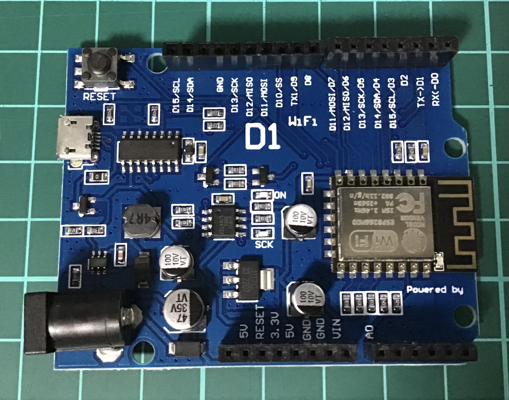
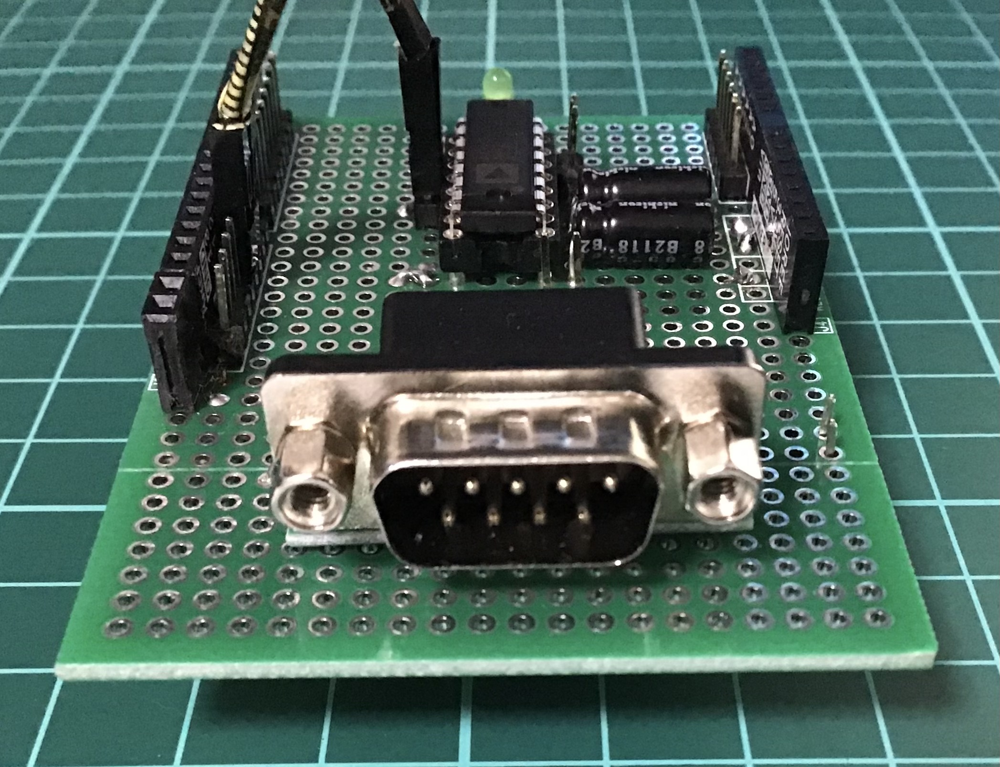
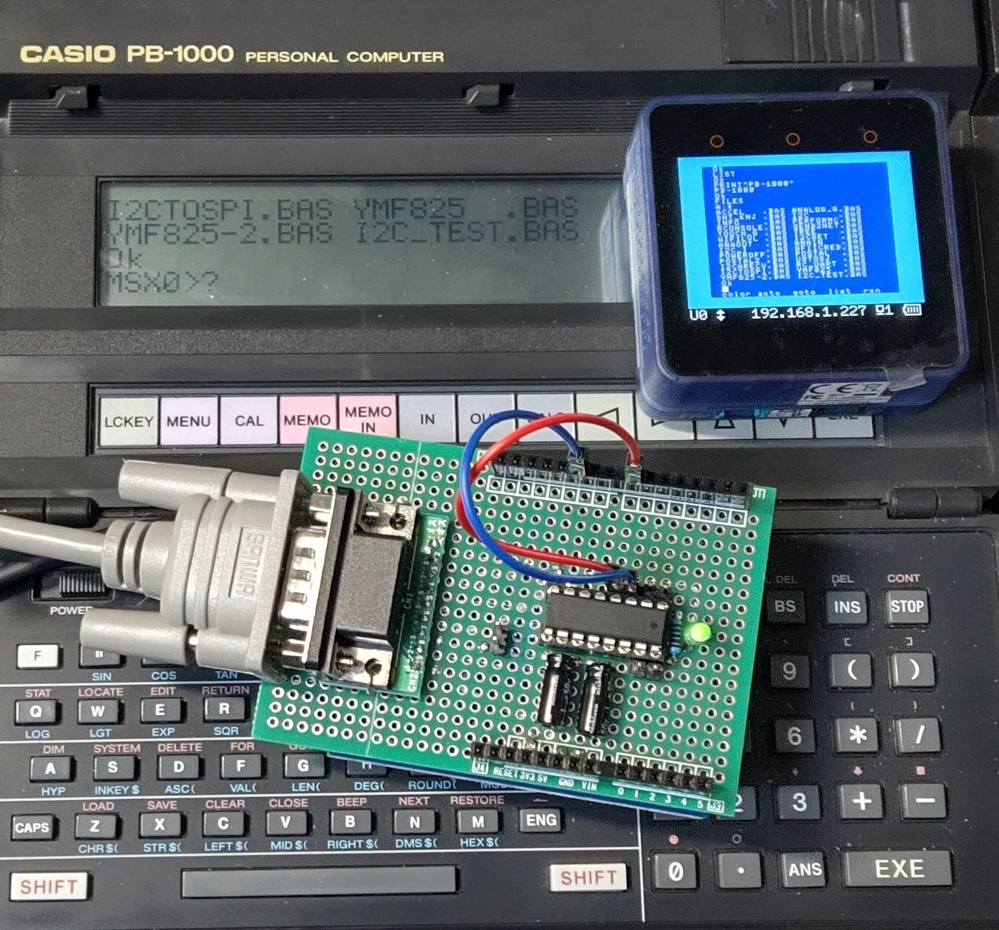

# 外部からUARTで受信した文字列をWiFi経由でMSX0のリモートコンソールに送信して、応答内容をUARTに返信するサンプル<!-- omit in toc -->

- [能書き](#能書き)
- [利用準備](#利用準備)
- [UARTシールドの構造](#uartシールドの構造)
- [利用手順](#利用手順)

## 能書き

外部からUARTで受信した文字列をWiFi経由でMSX0のリモートコンソールに送信して、応答内容をUARTに返信するサンプルコードです。

UARTとWiFiを仲介するのにWeMos D1というWiFiを搭載したArduino互換ボード的なものを使っています。



外部からのUARTはTTLレベルのものを想定しているので、ADM3202などのレベルコンバータを介してWeMos D1に入力するためのシールドを作っています。



ここでは、外部から文字列を送受信するための端末として、中の人がお気に入りのポケコン「カシオ PB-1000(+FA-7)」を使っています。



端末については、RS-232Cの送受信ができるものであれば、だいたい何でも大丈夫だと思います。

## 利用準備

MSX0側は、ほとんど何も準備することがありません。MSX0をWiFiに接続しておくだけで大丈夫です。

WeMos D1には、`ESP8266`フォルダに入っている２つのソースをArduino IDEで開いて、転送しておきます。

UART端末（PB-1000）には、`PB-1000`フォルダに入っている`MSX0RC.BAS`を入れておきます。

## UARTシールドの構造

DSub9ピンコネクタ→ADM3202→WeMos D1となるように組みます。

DSub9ピンで今回の通信に使うのは３つ(1,3,4ピン)だけです。
ADM3202は想定仕様通りの接続かと思います。
WeMos D1はD10/D11(GPIO13/15)をUART通信用に使います。

|内容|DSub9ピン番号|ADM3202ピン番号|WeMosD1ピン番号|
|------|--------|-------|-----|
|GND|1|-|GND|
|TX(TTL)|3|13(R1in)|-|
|RX(TTL)|4|14(T1out)|-|
|TX(CMOS)|-|12(R1out)|D11(GPIO13/RX0)|
|RX(CMOS)|-|11(T1in)|D10(GPIO15/TX0)|


## 利用手順

PB-1000でMSX0RC.BASを実行します。

```
MSX0>
```

というプロンプトが出ますので、好きな内容を入力してEnterを押下します。

たとえば、`PRINT 123+456`などと入力しますと、

```
MSX0>PRINT 123+456
579
```

のように実行結果（MSX0上で最初のコードを実行して表示された内容）が表示されます。

以上
